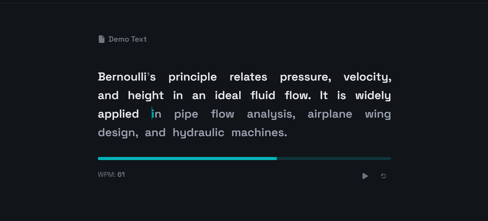
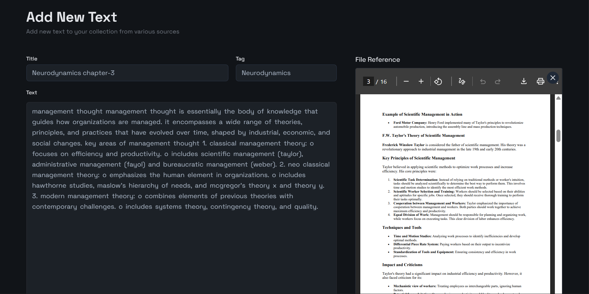
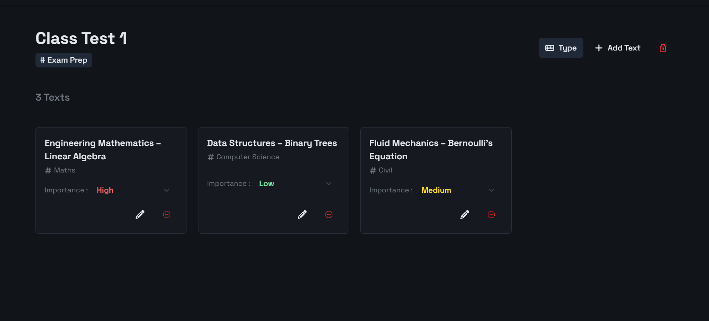

# TypeSmart  

🔗 **Live App (Main)**: [Visit Typesmart](https://typesmart.pythonanywhere.com)  
🔗 **Demo (No Auth Needed)**: [Tryout Typemsart Demo](https://typesmart.pythonanywhere.com/demo/typing)  

---

## About  
TypeSmart is a **chill typing webapp** that helps you practice typing with your **own content**.  
Instead of random filler texts, you can upload your own notes, book excerpts, or research material, make groups, organize everything in your library and type in a **minimal, distraction-free interface**.  

With two modes available:  
- **Main** → Full version, requires authentication (Google Sign-In).  
- **Demo** → Fully working demo, no sign-in required.  

---

## Why I Built It  
Most typing apps focus only on speed and leaderboards.  

I wanted something calmer:  
- A way to **grow smarter without even tyring**.  
- A space where typing practice feels **useful and stress-free**.  
- A tool that helps me **learn subconsciously**, just by typing.  

---

## Features  
- ✍️ Add new texts from anywhere (with file/PDF reference support).  
- 📂 Create groups of texts and assign importance (High / Medium / Low).
- ✨ Same text can have different importance in different groups.  
- 🎯 Smart generation — important texts appear more often.  
- 🧘 Minimalistic, zero-distraction typing interface.  
- 🚀 Demo mode (no login required).  
- 🎨 5 beautiful dark themes (inspired by Monkeytype).  

---

## Screenshots  
### 📸 Clean Minimalistic Typing Interface

### 📸 Add Texts with PDF or Text file Reference on the side

### 📸 Create groups of different texts with different importances

---

## Tech Stack

| Layer        | Tech Used                          |
|--------------|------------------------------------|
| Frontend     | React, TypeScript, Vite            |
| Backend      | Django, Supabase Python Client     |
| Auth         | Supabase OAuth (Google)            |
| Deployment   | PythonAnywhere                     |

---

---

## Try the Demo

You can try out the demo version [here](https://typesmart.pythonanywhere.com) and share your thoughts directly from the homepage header. Every piece of feedback comes straight to me — I read it all.

---

<h1 style="text-align: center; font-family: monospace">Thank You</h1>